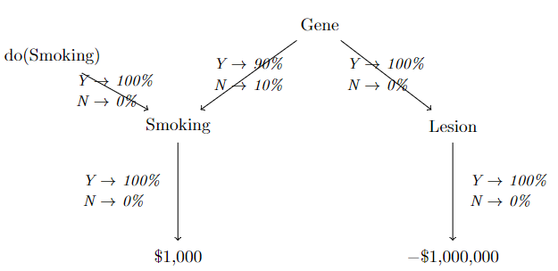
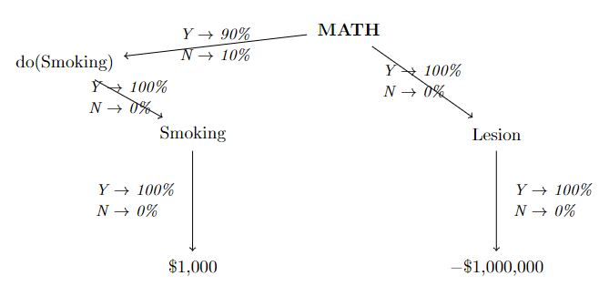

(TL;DR: AI alignment is not only mankind’s last technological challenge, it is also the final boss of philosophy and of economics.)

**Table of contents:**

- Everything is Bounded Rationality (philosophy, market dynamics, embedded agency)
- Bounded Rationality is Markets is Learning
- Bounded Rationality is Coherent Extrapolated Volition (what does it mean for a program to have desires?)
- Actually, Bounded Rationality is Alignment (not Learning). (Selection theorems, WWFD)
- How Markets can help with Alignment

## Everything left is about Bounded Rationality

> When you were young and innocent, you thought logical positivism and utilitarianism answered all the questions of philosophy. Then you realized that it did not account for uncertainty in inferring things you didn't directly observe. Then you thought that Bayes's theorem and Expected Utility theory answered all the questions of philosophy. Then you realized it did not account for logical (or more generally algorithmic) uncertainty.

A better understanding of bounded rationality — i.e. _updating on algorithmic information_ — is the final problem of philosophy. It is interesting to consider some analogous questions, regarding the Efficient Market Hypothesis.

> **Broke:** The market efficiently aggregates all information and conditions on it. (But computing what’s efficient — or even computing arbitrage, like comparing products, picking up pennies from the street, or finding the shortest queue at the mall — is itself a form of _labour_, and has a cost! If finding the optimal allocation of resources is too expensive, then the market _won’t_ (and shouldn’t) compute it — and in general, the market takes _time_ to compute this equilibrium, i.e. it has its own dynamics.)

> **Woke:** The market is efficient if you account for information/computational power as a resource. (But if compute is itself a resource, then figuring out the optimal allocation of compute is itself an economic problem! — and therefore itself has a market, subject to computational costs, ad infinitum.)

> **Bespoke:** You all have it backwards: the EMH is a _definition_, defining the “rational way to aggregate information” as the market mechanism. It is an _epistemological_ statement, giving markets their place at the foundations of computational philosophy, analogous to the place enjoyed by Bayes at the foundations of classical philosophy.

To understand what this means in practice: for example, even when the market is exhibiting “out-of-equilibrium behaviour” (e.g. in the process of responding to a supply shock), it is doing the “right” thing, conditional on informational and computational constraints. The specific dynamics exhibited by the market, or the heuristics it employs, are _learned behaviours_ on what to do in such a situation. Well, it may also just not have learned anything for said situation so far and acting on some “prior”, or learned that it’s not worth learning any heuristic in such a situation, etc.

> Bounded rationality is “rule utilitarianism” while perfect rationality is “act utilitarianism”.

You know what else is about algorithmic information? 

### Functional Decision Theory is Bounded Rationality

Functional Decision Theory [DT1, DT2].

*Smoking lesion problem*

*Smoking Lesion problem — Newcomb’s version*

Above is my preferred way to frame the Smoking Lesion problem. I think that rumours of the death of Evidential Decision Theory have been greatly exaggerated (on this note: [DT4]), and comes from mistakenly conditioning on “Smoking” instead of the full information we have available, which is “do(Smoking)” (see my preferred way of framing causal diagrams in [O1] — IDK why people make “do” an operator and stuff, it’s clearly just a variable). The key special thing about “logical correlations” is that they are able to force a correlation between “do(…)” and other things, you can’t make a true “intervention”, which means causation actually breaks down.

This is what “embedded agency” really means: that there are things _truly_ prior to your decision-making procedure. Remember the basic law of causal diagrams: a node is (conditional on its parents) independent of its non-descendants. That’s why we have “do” operators: things that have no parents, so they act precisely as “targeted interventions”. But because of embedded agency, you sometimes _can’t_ have true “interventions” in this sense. Also, this is why precommitment leads CDT to give the same prescription as EDT: precommitment just means adding another (true) “do(…)” handle to the embedded one.

Another way of putting it is that when you extract yourself from the universe, you can see all the outcomes as being in your causal future. But when your “do(…)” handle is within the universe, your actions actually in some sense travel “back in time” (back up the causal diagram). This is analogous to how Gödel’s incompleteness theorem is basically the same as the Grandfather paradox [O2].

Anyway, the point is that the only way information can “travel back in time” in this sense is when it’s algorithmic information, because it doesn’t actually have to travel back in time, it’s just that the same computation is being performed far away, but unlike with classical correlations this algorithmic information can actually be the outcome of your own decision-making procedure.

## Bounded Rationality is Markets is Learning

What the Efficient Market Hypothesis tells us is that markets are _an_ example of a boundedly rational mechanism. Moreover, once you look at markets, it is hard to imagine any _other_ example of bounded rationality in the wild. It almost seems as if markets _should be_ the definition of bounded rationality. This would make our whole enterprise vacuous so we shouldn’t do that — but look!

- Markets do the same "kinds of things" as intelligent agents — they form beliefs (prices) and take decisions (allocate goods) from them.
- Beliefs may be incomplete (there's not an asset for every state of the world) or inconsistent (unexploited arbitrage).
- These beliefs and decisions relate to each other in various ways; propagate.
- Markets have self-awareness: they can reason about themselves (assets representing the market’s own properties) and self-improve.
- Markets “learn” via a mechanism known as _capitalism_: traders and pathways in a market, when they do good things, gain wealth and therefore influence on the market’s future behaviour. These individual firms etc. are our learned “heuristics” (see [BR1]).
- Markets generalize Bayesian reasoning. See [MI1], and the fact that market-makers in prediction markets generalize the concept of a _Bayesian prior_. But this needs further elaboration for propagation/BayesNets etc.

One way to salvage the precision of the Efficient Market Hypothesis is as follows: the market “dominates” each of its individual traders, in that it will eventually do at least as well as its best trader.

  

  

  

## References

### Prediction markets and information

[M1] A deep theoretical understanding of prediction markets: [Prediction markets, Mechanism design and Co-operative Game theory](http://arxiv.org/abs/1205.2654) by Vince Conitzer (2012)

### Bounded Rationality

[BR1] A non-technical overview of bounded rationality: [Towards a Rational Theory of Heuristics](https://link.springer.com/chapter/10.1057/9781137442505_3) by Gerd Gigerenzer (2016)

[BR2] Bounded optimality: [Provably Bounded-Optimal Agents](https://arxiv.org/abs/cs/9505103) by Russell & Subramanian (1995)

[BR3] Intelligence as Bounded Rationality: [Rationality and Intelligence: a brief update](https://link.springer.com/chapter/10.1007/978-3-319-26485-1_2) ([full text](https://citeseerx.ist.psu.edu/document?repid=rep1&type=pdf&doi=317d1e4545839b60364c1951c117fb74963d6bb9#:~:text=This%20paper%2C%20which%20updates%20a,gap%20between%20theory%20and%20practice.)) by Stuart Russell (2016)

### Embedded agency/Decision theory

[DT1] The main FDT paper: [Functional Decision Theory](https://arxiv.org/abs/1710.05060) by Yudkowsky & Soares

[DT2] A nice explanation of FDT I like: [Consistently Reflecting on Decision Theory](https://risingentropy.com/consistently-reflecting-on-decision-theory/) by Rising Entropy

[DT3] Markets would do EDT: [Futarchy implements Evidential Decision Theory](https://casparoesterheld.com/2017/12/18/futarchy-implements-evidential-decision-theory/) by Caspar Oesterheld (2017)

[DT4] A defense of EDT: [Why the Smoking Lesion does not refute EDT](https://casparoesterheld.com/overview-why-we-think-that-the-smoking-lesion-does-not-refute-edt/) by Caspar Oesterheld

### My previous related posts

It’s weird to have a bibliography section dedicated to self-cites, but the idea is that it serves as elaboration (removes the need to reply in a comment) for whenever I say something weird or controversial. More generally think of it as an “Apologia” section.

[O1] How I think about causation: [Further notes on causation](https://thewindingnumber.blogspot.com/2021/08/further-notes-on-causation.html)

[O2] Gödel’s theorem is like the grandfather paradox: [Gödel, Turing and time travel](https://thewindingnumber.blogspot.com/2020/09/godel-turing-and-time-travel.html)

### Lampposts for drunks

Not intellectually relevant, but stuff that supports my general point.

[X1] Simulations of dumb traders, paper zero: [Allocative Efficiency of Markets with Zero-Intelligence Traders: Market as a Partial Substitute for Individual Rationality](https://www.journals.uchicago.edu/doi/10.1086/261868) by Gode & Sunder (1993)

[X2] Simulations of dumb traders: [What makes markets allocationally efficient?](https://academic.oup.com/qje/article/112/2/603/1870942) by Gode & Sunder (1997)

[X3] Simulations of dumb traders: [How much irrationality does the market permit?](https://www.journals.uchicago.edu/doi/10.1086/519963) by Alan Schwartz (2007)

[X4] Simulations of dumb traders: [Simple agents, Intelligent Markets](https://papers.ssrn.com/sol3/papers.cfm?abstract_id=2478665) by Jamal, Meier and Sunder (2014)