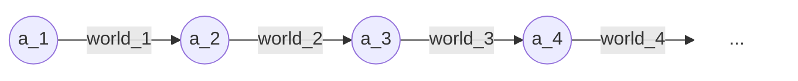

In a general sense, markets and intelligent agents do “essentially the same things”:

- They take decisions (allocate goods) and compute beliefs (prediction markets)
- Beliefs may be inconsistent (arbitrage) or incomplete. In fact they _must_ be incomplete: there can never be an asset for every state of the world — due to a [simple counting argument](https://risingentropy.com/four-pre-godelian-limitations-on-mathematics/).
- Anyone who has struggled a bit philosophically with the problem of _bounded rationality_ understands how similar it is to _the efficient market hypothesis_. In fact, bounded rationality — or “optimality conditional on algorithmic information” — is the way to _salvage_ the efficient market hypothesis.
- Markets have self-awareness: they can reason about themselves (have assets representing their own properties) and self-improve (make decisions to modify their architectures in some way, or more commonly supply goods to adjust their own computational capacity).

Unsurprisingly, several

**footnote on bounded rationality**

The problem of developing a “general theory” of bounded rationality — i.e. a theory of what is a rational belief or decision given *computational* (rather than only informational) constraints such as logical non-omniscience — has been considered since [@simonModelsManSocial1957]. The trouble is that you cannot simply just “determine the best program given computational costs” either — doing so is itself an uncomputable task in general (or at least always computationally expensive in itself). So you have an infinite descent, 

**hope: alignment**

markets are aligned. If you think of consumer behaviour as the reward function then markets do act as optimizers for that. Why? (1) they know the consumer is going to be there, won’t get unalived. (2) competition (3) nothing that leads to spontaneous mesa-optimizers appearing

**deep markets**

**comparison to other approaches**

- **Ensemble models vs deep markets** — Some existing “market-based” models of AI are essentially just ensemble models, which require highly intelligent pretrained sub-agents. Instead I believe that intelligence “emerges” from connecting dumb agents together in a supply chain.
- **Algorithmic description of market dynamics** — A precise model of a market. In particular it should capture the following functions of markets:
	- **Elicitation** — To the end consumer, a market is a *measuring device for his values and beliefs*. By auctioning a good to him, you measure how much he wants it (this is not exactly true, we should make it more precise); likewise, by auctioning a contingent contract (i.e. a prediction market), you measure how much he believes an event will occur. 
	- **Propagation** — Markets “propagate” these values and beliefs down the supply chain. A consumer may never need to think about how much he values industrial tools and fertilizer, but the market will calculate it for him. Equivalently, propagation is a “[credit assignment](https://www.lesswrong.com/posts/Ajcq9xWi2fmgn8RBJ/the-credit-assignment-problem)” mechanism.
	- **Competition** — Competition seems fundamental to how markets actually achieve these functions. Productive and allocative efficiency work this way; price calculation/credit assignment works this way (if a worker is paid less than how much value he creates for a particular supply path, other supply paths would be incentivized to pay him more).
	- **Emergent intelligence** — Markets allow for relatively dumb people to come together and form a much more intelligent, informed system. In a sense, it automatically learns how to decompose a task. 
	- **Meta-learning** — There is not quite one “market mechanism”, but rather the market can choose the protocols of trade. The market can also learn non-market mechanisms, like firms (?).
- **Economic calculation problem** — take the common take (e.g. [Acemoglu on X](https://twitter.com/DAcemogluMIT/status/1660269232699977730?s=20)) that “Central planning with enough computational power can replace markets, because ultimately markets are just an algorithm”. Standard response to this are: “I like broccoli now“, another is something about the informational efficiency of markets in mechanism design, e.g. by [Brian Albercht](https://www.economicforces.xyz/p/how-much-information-do-markets-require), another is “you're just going to reinvent markets lol”. I think this conversation — as well as e.g. conversations about the efficient market hypothesis — would benefit from a better understanding of what markets are exactly, whether its distributed nature implies some fundamental wastefulness or transaction costs (as e.g. [Gwern muses](https://gwern.net/backstop#asymptotics-ascendant)). 

This post is in part an extension to the intuitive idea presented by [MI1] John Wentworth (2019), [Competitive Markets as distributed backprop](https://www.lesswrong.com/posts/brhWPoNsBN7za3xjs/competitive-markets-as-distributed-backprop). 

## Latent Variable Prediction Markets

Prediction markets are cool — they work to get you the best possible estimate for any question you might have — but they have one key limitation: they only work for questions where ground truth will be directly revealed in future — or more generally, for questions that are either *verifiable* or *falsifiable*. 

(Well I did try my hand in generalizing this to *first-order (or generally hyperarithmetical) logic* sentences: [PM1] Me (2023), [Betting on what is un-falsifiable and un-verifiable](../posted/Betting%20on%20what%20is%20un-falsifiable%20and%20un-verifiable.md) ([arXiv](https://arxiv.org/abs/2402.14021)), but this barely scratches the surface of the realm of sentences we have beliefs about.)

Take e.g. historical questions (“Did Jeffrey Epstein kill himself?”), imprecise questions (“Is journalism dying?”), or generally questions about the noumenal world (“What is the true casualty count of the Israel-Hamas war?”) — all of which are questions which intelligent agents routinely ponder. Why do we regard such sentences as meaningful? Why do (unrelated, independent) agents often converge on mental models in which such sentences are meaningful? What makes them useful?

The reason that intelligent agents are interested in “subjective sentences” is that they **capture correlations** between more concrete, directly observable sentences. “Did Bob commit the murder?” is a “principal component” that captures correlations between questions like “Will crime rates increase if we release Bob?”, “Will evidence emerge of Bob being the murderer?”, “Will Bob write in his autobiography that he did the murder?”.

Thus “subjective sentences” are best thought of as “**latent space variables**”. They are agents’ *internal representations*, learned because they are useful in downstream tasks. One proposal for “latent variable prediction markets” comes from [PM2] tailcalled (2023), [Latent variables for prediction markets](https://www.lesswrong.com/posts/ufW5LvcwDuL6qjdBT/latent-variables-for-prediction-markets-motivation-technical).


```tikz
\usepackage{tikz}

\begin{document}
\begin{tikzpicture}

  % Nodes X1, X2, ..., Xn vertically spaced and in a straight line, with circles
  \node[circle, draw] (X1) at (3,1.5) {$X_1$};
  \node[circle, draw] (X2) at (3,0) {$X_2$};
  % Manually adjust "\vdots" position to align with the midpoint if necessary
  \node (dots) at (3,-1.5) {$\vdots$};
  \node[circle, draw] (Xn) at (3,-3) {$X_n$};

  % Y node centered to the X nodes, with a circle
  \node[circle, draw] (Y) at (0,-0.75) {$Y$};
  % Label for Y, adjust position if needed to not overlap with arrow
  \node at (0,-1.5) {$\scriptstyle P(Y)$};

  % Arrows from Y to X1, X2, ... , Xn, with smaller P(...) labels
  \draw[->] (Y) -- (X1) node[midway, above, sloped] {$\scriptstyle P(X_1|Y)$};
  \draw[->] (Y) -- (X2) node[midway, above, sloped] {$\scriptstyle P(X_2|Y)$};
  \draw[->] (Y) -- (Xn) node[midway, above, sloped] {$\scriptstyle P(X_n|Y)$};
  
\end{tikzpicture}
\end{document}
```


I think a TL;DR of his idea is something like this: instead of letting traders directly bet on the joint distribution $P(X_1,\dots X_n)$, we let them bet on $P(Y)$ and any $P(X_i|Y)$ and score them on the calculated joint distribution.

He seems to be stressing on natural language descriptions of $Y$, but I think you should rather let the **latents be a hidden variable layer** and have the market discover what it means. The natural language description of $Y$ should hopefully be completely redundant: instead the market will find **natural choices for latents**, where the “meaning” of a latent $Y$ is determined entirely by its conditional distributions $P(X_i|Y)$.

### John Wentworth’s Natural latents

Sorta relevant: [NL1] John Wentworth (2023), [Natural latents: the math](https://www.lesswrong.com/posts/dWQWzGCSFj6GTZHz7/natural-latents-the-math#Universal_Natural_Latent_Conjecture) and references therein [NL2], [NL3], [NL4]. My summary:

I think his “fundamental theorem” is just a generalization of [sufficient statistics](https://thewindingnumber.blogspot.com/2021/04/sufficient-statistics.html): a statistic $\Lambda(\mathbf{X})$ that is sufficient for all $X_1,\dots X_n$ is also sufficient for any “insensitive” variable $\Lambda'(\mathbf{X})$, because $\Lambda$ contains every bit of mutual information, and $\Lambda’$ can’t depend on any $X_i$-specific information, so it has to be only determined by mutual information. Furthermore if $\Lambda$ is both sufficient and insensitive (“a natural latent”), it is a minimal sufficient statistic.

(He doesn’t write these as random functions of $\mathbf{X}$, but that’s essentially what “resampling latents” does in this case.)

What’s more interesting is his claim that (if there is at all a natural latent) there is a natural way to construct a natural latent, via “simultaneous resampling”, described in [NL2], [NL3], [NL4]. I guess he takes this as leading to answer the question “why do agents tend to make up the same latents?”. But I would expect that in reality the uniqueness of natural latents comes from further connections in the causal graph/”generalization”.  

### Gauge group for latent space 

Gauge groups  I think it is worth noting that there is an associated “**gauge invariance group**” to the latent space limiting how universal these latents really are. The simplest example is stuff like $\Lambda\to-\Lambda$, but also you could imagine e.g. different quantum interpretations, different metaphysical pictures, or a radically different physics theory that doesn’t have quarks or something.

### DGMM

Here is some related work, which also employs the same overall framework: “a deep neural network where each neuron is computed as a probability distribution over the previous layer”, but the training mechanism isn’t a market mechanism:

[DP1] Viroli & McLachlan (2017), Deep Gaussian Mixture Models. http://arxiv.org/abs/1711.06929

[DP2] Bishop (1994), Mixture density networks. https://publications.aston.ac.uk/id/eprint/373/1/NCRG_94_004.pdf

### PCA


## Example: Baum’s agents that “sell the world”

The idea of intelligence arising from markets has appeared in e.g. 

[MI3] classifier systems, e.g. in the [Hayek machine](https://link.springer.com/article/10.1023/A:1007593124513) and references therein

[PM3] logical uncertainty, e.g. [Garrabrant Induction](https://arxiv.org/abs/1609.03543) 

[PM4] bounded rationality, e.g. Oesterheld et al, [“A Theory of Bounded Inductive Rationality”](https://arxiv.org/abs/2307.05068). 

The first of these — in which a market of relatively simple programmatic agents solve Tower of Hanoi — is particularly interesting, because it specifically addresses how intelligence emerges from a market of relatively *dumb* programs (which is important if you want markets to be anything more than an instrument for “choosing the best performers” out of an ensemble of already intelligent programs).

The Hayek machine looks like this: at each stage, an agent holds “write access to the world”, and it performs some action and obtains its reward. Then “write access to the world” is auctioned to the highest bidder, who pays its bid to our agent and becomes the new owner of the world. Well, we can think of this as a linear supply chain:



(Arrows for rewards generated at each point in time are suppressed)

```tikz
\usetikzlibrary{automata, positioning, arrows, shapes}

\begin{document}
\begin{tikzpicture}[->, >=stealth, auto, semithick, node distance=3cm]
\tikzstyle{agent}=[circle, thick, draw=black, fill=gray!20, minimum size=1cm]
\tikzstyle{utility}=[diamond, draw=black, fill=blue!20, minimum size=1cm, align=center]

% agents
\node[agent] (S1) {$\alpha_1$};
\node[agent] (S2) [right of=S1] {$\alpha_2$};
\node[agent] (S3) [right of=S2] {$\alpha_3$};
\node[agent] (S4) [right of=S3] {$\alpha_4$};
\node (ASO) [right of= S4] {$\dots$};

% utilitys
\node[utility] (O1) [below right = 1cm and 0.5cm of S1] {$U_1$};
\node[utility] (O2) [right of = O1] {$U_2$};
\node[utility] (O3) [right of = O2] {$U_3$};
\node[utility] (O4) [right of = O3] {$U_4$};

% Paths
\path (S1) edge node {world$_1$} (S2)
      (S2) edge node {world$_2$} (S3)
      (S3) edge node {world$_3$} (S4)
      (S4) edge node {world$_4$} (ASO);

% utility links
\draw[dashed] (S1) -- (O1);
\draw[dashed] (S2) -- (O2);
\draw[dashed] (S3) -- (O3);
\draw[dashed] (S4) -- (O4);

\end{tikzpicture}
\end{document}

```

With perfect competition, equilibrium looks like:
* Each agent bids its estimate for the value of the world after its action (i.e. the total reward that will be generated by the world) **(price efficiency)**
* The agent that can generate most value wins the auction **(allocative efficiency)**
* Each agent is incentivized to take the most value-adding action, as that earns it the greatest sale value **(productive efficiency)**

… because any agent that underbid would be beaten by an identical agent that bid the correct value. 

(In this simple set up, each agent in the chain makes zero profit at equilibrium: all value created is earned by the original owner of the “write access to the world” resource. This is because in our setting “write access to the world” is the only scarce resource, while the agents’ labour is in infinite supply — the agents have nothing else to do with their labour; there is no opportunity cost that paying them would account for.)

Observe that:
1. the **depth** of the chain is crucial to its “emergent intelligence” property: it lets different agents just figure out at what point they should bid to join the chain/when they have value to add, rather than having a whole bunch of agents just compete to complete the entire task.
2. the depth of the chain isn’t fixed, but rather depends on when agents stop bidding (e.g. because there is no longer any reward left to be extracted). In other words, at least to an extent the model “**hyperparameters**” are also determined by market mechanisms.

Let us specify the model fully.


## References
### Links

- [credit assignment](https://www.lesswrong.com/posts/Ajcq9xWi2fmgn8RBJ/the-credit-assignment-problem)
- [Acemoglu on X](https://twitter.com/DAcemogluMIT/status/1660269232699977730?s=20)
- [Brian Albercht](https://www.economicforces.xyz/p/how-much-information-do-markets-require)
- [Gwern muses](https://gwern.net/backstop#asymptotics-ascendant)
- [sufficient statistic](https://thewindingnumber.blogspot.com/2021/04/sufficient-statistics.html)


### Markets and intelligence

[MI1] John Wentworth (2019), [Competitive Markets as distributed backprop](https://www.lesswrong.com/posts/brhWPoNsBN7za3xjs/competitive-markets-as-distributed-backprop)

[MI2] Me (2024), [Bounded rationality is AI alignment](../Bounded%20rationality%20is%20AI%20alignment.md) (**DRAFT**)

[MI3] Eric Baum (1999), [Toward a Model of Intelligence as a Laissez-Faire economy of idiots](https://link.springer.com/article/10.1023/A:1007593124513)

### Prediction markets

[PM1] Me (2023), [Betting on what is un-falsifiable and un-verifiable](../posted/Betting%20on%20what%20is%20un-falsifiable%20and%20un-verifiable.md) ([arXiv](https://arxiv.org/abs/2402.14021))

[PM2] tailcalled (2023), [Latent variables for prediction markets](https://www.lesswrong.com/posts/ufW5LvcwDuL6qjdBT/latent-variables-for-prediction-markets-motivation-technical)

[PM3] Scott Garrabrant et al (2016), [Logical Induction](https://arxiv.org/abs/1609.03543)

[PM4] Caspar Oesterheld et al (2023), [A Theory of Bounded Inductive Rationality](https://arxiv.org/abs/2307.05068)

### Natural latents

[NL1] John Wentworth (2023), [Natural latents: the math](https://www.lesswrong.com/posts/dWQWzGCSFj6GTZHz7/natural-latents-the-math#Universal_Natural_Latent_Conjecture)

[NL2] Nate Soares (2023), [A rough and incomplete overview of some of John Wentworth’s claims](https://www.alignmentforum.org/posts/mgjHS6ou7DgwhKPpu/a-rough-and-incomplete-review-of-some-of-john-wentworth-s#The_Math)

[NL3] Lawrence Chan et al (2023), [Natural Abstractions: Key Claims, Theorems, and Critiques](https://www.alignmentforum.org/posts/o7sN7moJA8TrZKtKi/appendix-natural-abstractions-key-claims-theorems-and#Minimal_Latents_of_MNIST)

[NL4] John Wentworth (2022), [Abstractions as Redundant Information](https://www.alignmentforum.org/posts/vvEebH5jEvxnJEvBC/abstractions-as-redundant-information)

## Deep Probabilistic Models

[DP1] Viroli & McLachlan (2017), Deep Gaussian Mixture Models. http://arxiv.org/abs/1711.06929

[DP2] Bishop (1994), Mixture density networks. https://publications.aston.ac.uk/id/eprint/373/1/NCRG_94_004.pdf