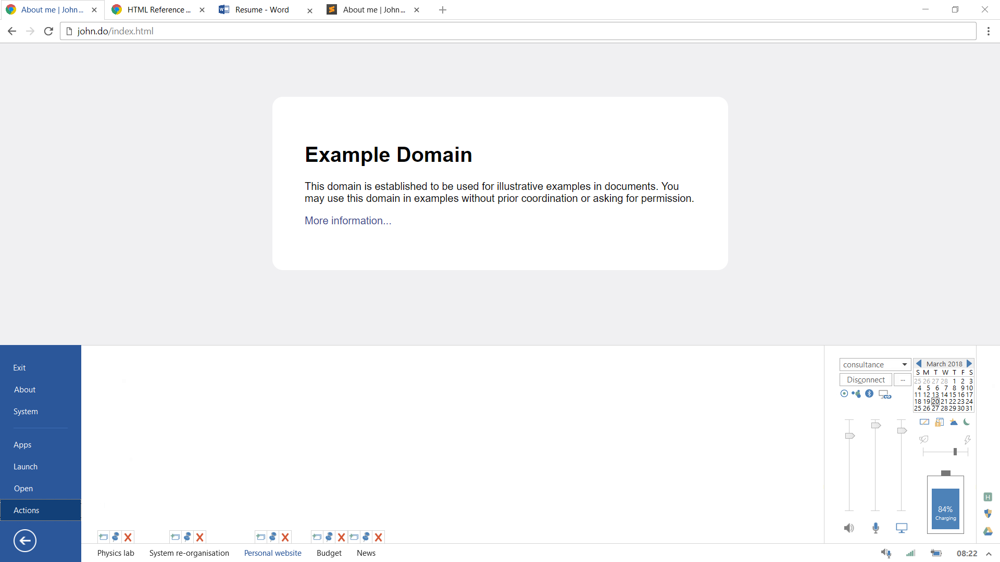
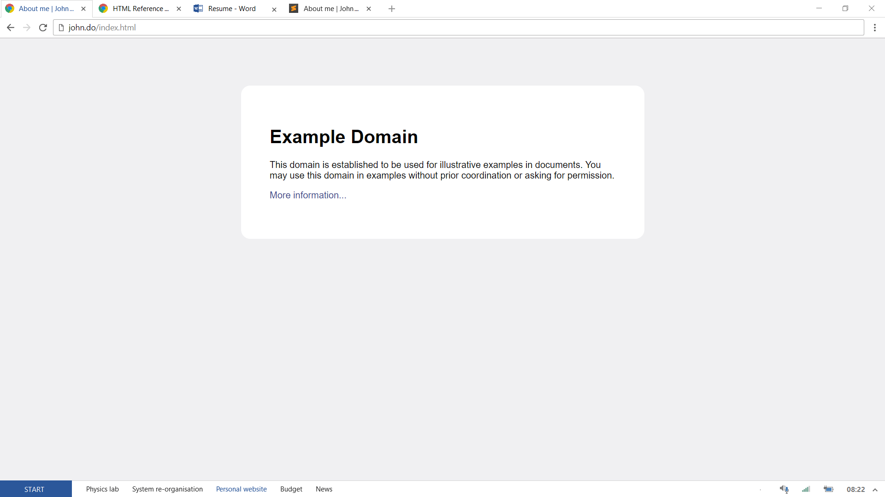
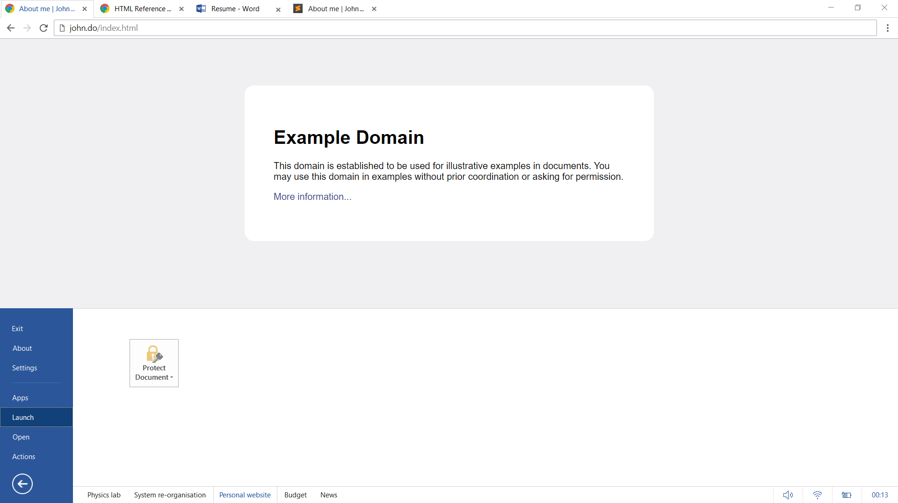
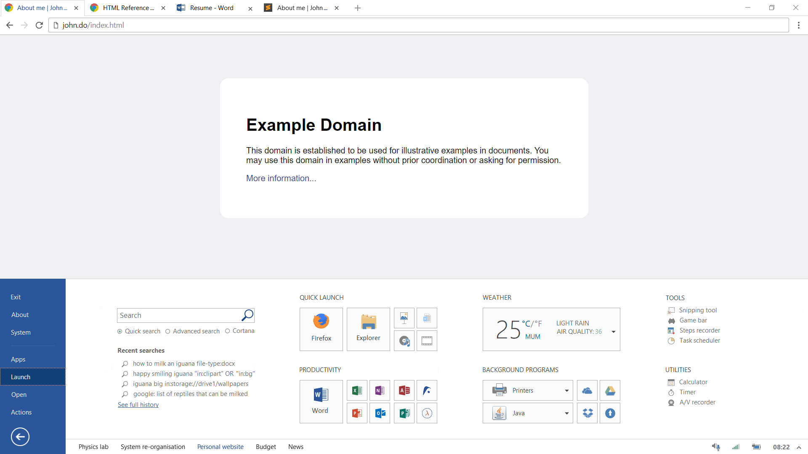
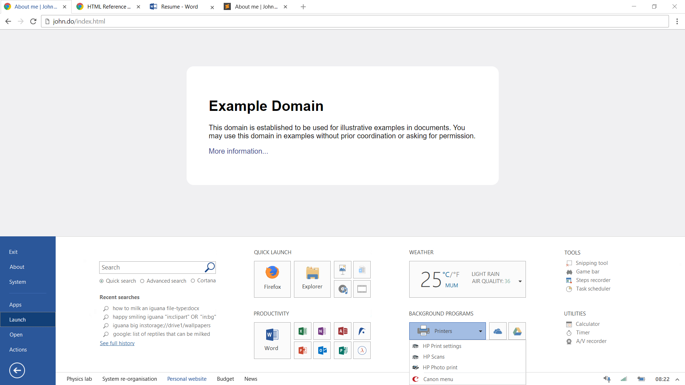
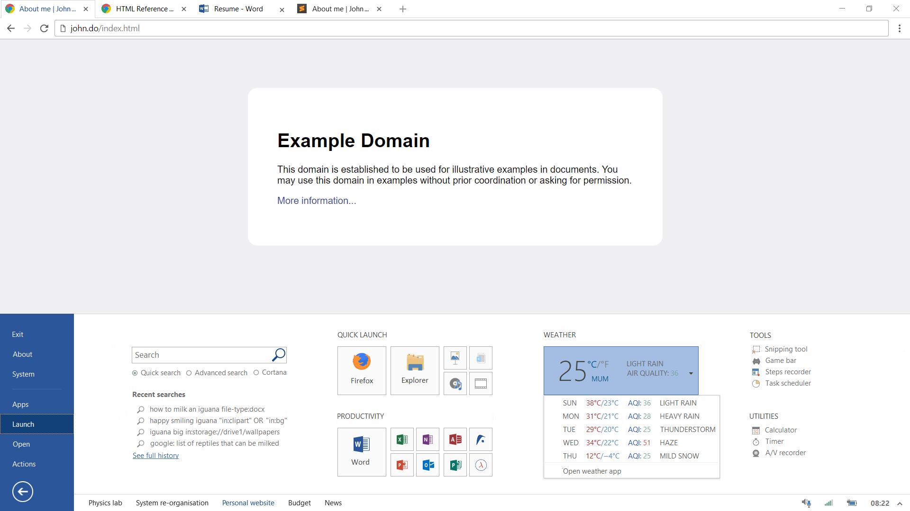

add "connected devices" to Networks
fix tab bar2

1.  Open set
2.  Start menu opened from button -- "Launch" -- tiles including tile groups, search, tools, utilities
3.  Start menu opened from button -- "Launch" -- open tile group
4.  Start menu opened from button -- "Launch" -- open widget
5.  Start menu opened from jumplist -- "Actions" -- jumplists, including for free window; system dialogs and notifications
6.  Jumplists on set tabs -- include "new instance", "duplicate instance", "copy path" 
7.  Start menu opened from system tray -- "Actions", focused on relevant control
8.  Connecting to Wi-Fi network -- wi-fi mobile and vpn
9.  "Tablet mode" menu opened
10. "Night light" menu opened
10. "Homegroup" menu opened -- project display, project here, remote desktop, hotspot | more device-sharing, shared files, configure router (192.168.225.1)
11.  Snapping within a set
12. File explorer -- context menu, omnibar, breadcrumb, quick access button
13. Settings window -- UI
14. Settings window -- start menu customisation (change icon, etc.)
15. Settings window -- Hardware
16. Quick windows -- non-maximised windows
17. Context menu on taskbar
18. Context menu on start tiles
19. File system
20. Home/welcome screen
21. Touch mode (e.g. contextbar instead of contextmenu)
22. Keyboard shortcuts and trackpad/touchscreen gestures

START
* Exit (shut down symbol) -- Account, Power
* About -- About, Feedback
* System -- store, trash, downloads, history (page links to windows://osdata), settings, regedit, terminal ("runasadmin", "powershell", "ise"), run, taskmgr | admin tools
* ---
* Apps
* Launch -- tiles, search bar
* Open -- mini file explorer with omnibar and all, "recent"
* Actions -- jumplists (tiles for all windows), notifications, clock and controls, quick actions, extended systray

FILE SYSTEM
* windows://os-files
* windows://os-installers
* windows://os-data (including uilayout, systemicons, systemsounds, lock bgs, themedata, langfiles, defapps/fileassocs, foldviews, history (timeline, locsearchhis, connecthis, recopen))
* windows://app-files (categories: "GLOBAL", "DRIVERS", "USER1", "USER2"... and column to show if Win32, Win64, WinRT)
* windows://app-installers
* windows://app-data (also categorised)

* storage://drive1/user1
* storage://drive1/user2
* storage://drive1/...
* storage://drive2
* storage://drive3
* storage://drive...
* storage://shared/bluetooth
                  /group-home
                  /group-work
                  /group-chessclub
                  /groupdevices

Supports "file groups" within folders, included in file system with ":" instead of "/"

SETTINGS
* ui -- start, taskbar, context menu, sets, snapping, new tab, welcome page, lock screen, animations and sounds, keyboard shortcuts
* hardware -- including device manager, oem settings, peripheral oem settings
* internet -- all network stuff, connection preference order
* apps
* localisation -- time and language
* accessibility
* miscellaneous -- link to links to windows://config
* ---
* phone
* privacy
* account
* windows

