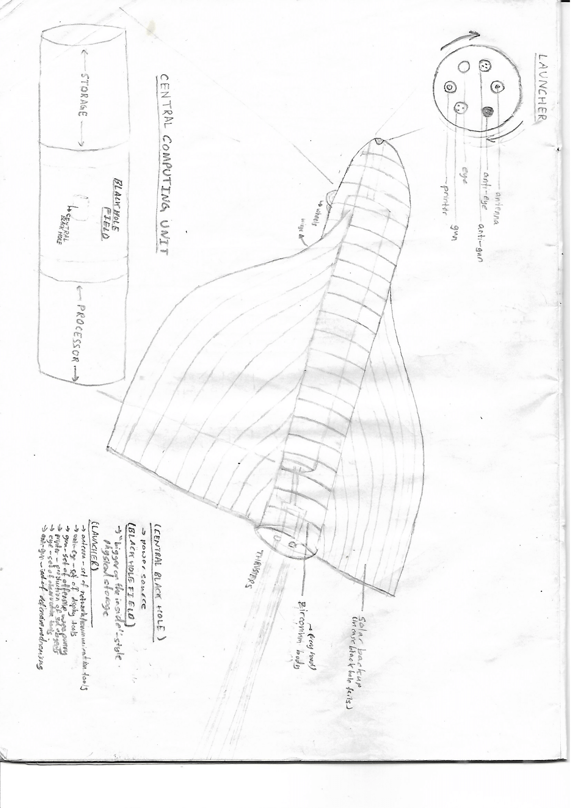

ULTRALORD

**Casing –** _Waterproof silicon carbide (sometimes zirconium)_                               “Mental”

**Transportation –** _Wings, wheels, engines and thrusters, terminal for maneuver plotting and other programming_

**Communication –** _Telepathy, internet,_ virternet (duat) _access; EM, neutrinos_  

**Self-manipulation –** _Teleportation, femtotech, coherent-army-creator, streamline/android forms_

**Observational –** _eyes (light, neutrinos, alpha/beta, g-waves, electricity…), ears (waves in surrounding medium), nose (chemical identification), skin (temperature, pressure, viscosity, force-meter/identifier, etc.), sonar-based assists for eyes and ears; sensors placed across casing, data can be combined to create complete map of surroundings_

**Display –** _extreme high-res: anti-eyes, anti-ears, anti-nose, anti-skin_

**Combat: attack –** _antimatter gun, [black hole bomb], laser-based weapons (when more precision, less destruction required); hacking_

**Combat: defense –** _shields (physical and force fields), iron dome deflection system, faraday’s_

**Other tools –** _Env manipulation, cloning, invisibility, conscience (dload, uload, ultreproduce), [unlimited storage (especially of basic teleportation-base material) via black holes], 3d print tools or recycle material, teleport tools and specific materials from storage areas, etc._

**Energy –** _chargeable, fusion, matter/antimatter, [black hole superradiance], backup: solar, metabolic (auto-prints metaboliser as battery runs low)_

CENTRAL BLACK HOLE: allows unlimited physical storage, energy generation, attack!

